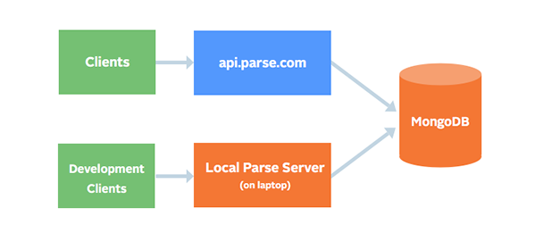

# docker-parse-server

[](https://gitter.im/yongjhih/docker-parse-server?utm_source=badge&utm_medium=badge&utm_campaign=pr-badge&utm_content=badge)

[](https://imagelayers.io/?images=yongjhih/parse-server:latest)


You should not build your parse-server image instead of reuse this yongjhih/parse-server image, then plugin your parse-cloud-code container and mongodb container.

Welcome PR.

Here is overview:



## Getting Started

```sh
docker run -d -p 27017:27017 --name mongo mongo
docker run -d -e APP_ID={appId} -e MASTER_KEY={masterKey} -p 1337:1337 --link mongo yongjhih/parse-server
```

* api: localhost:1337
* mongodb: localhost:27017

or with docker-compose:

```sh
wget https://github.com/yongjhih/docker-parse-server/blob/master/docker-compose.yml
APP_ID=myAppId MASTER_KEY=myMasterKey docker-compose up
```

### Usage of already mongodb with DATABASE_URI

```sh
docker run -d -e DATABASE_URI={mongodb://mongodb.intra:27017/dev} APP_ID={appId} -e MASTER_KEY={masterKey} -p 1337:1337 --link mongo yongjhih/parse-server
```

or with docker-compose:

```sh
wget https://github.com/yongjhih/docker-parse-server/blob/master/docker-compose.yml
DATABASE_URI={mongodb://mongodb.intra:27017/dev} APP_ID={myAppId} MASTER_KEY={myMasterKey} docker-compose up
```

### Usage of already parse-cloud-code

With host folder:

```sh
docker run -d -v /home/yongjhih/parse/cloud:/parse/cloud -e DATABASE_URI={mongodb://mongodb.intra:27017/dev} APP_ID={appId} -e MASTER_KEY={masterKey} -p 1337:1337 --link mongo yongjhih/parse-server
```

With volume container:

```sh
docker create -v /parse/cloud --name parse-cloud-code yongjhih/parse-cloud-code echo ls /parse/cloud
docker run -d --volumes-from parse-cloud-code -e DATABASE_URI={mongodb://mongodb.intra:27017/dev} APP_ID={appId} -e MASTER_KEY={masterKey} -p 1337:1337 --link mongo yongjhih/parse-server
```

### Usage of specific parse-server version

Specify parse-server:2.0.8:

```sh
docker run -d APP_ID={appId} -e MASTER_KEY={masterKey} -p 1337:1337 --link mongo yongjhih/parse-server:2.0.8
```

ref. https://github.com/ParsePlatform/parse-server/releases
ref. https://www.npmjs.com/package/parse-server

### Integration of parse-cloud-code image on GitHub and DockerHub

Docker:

1. Fork https://github.com/yongjhih/parse-cloud-code
2. Add your cloud code into https://github.com/{username}/parse-cloud-code/tree/master/cloud
3. Create an automated build image on DockerHub for forked {username}/parse-cloud-code repository
4. `docker pull {username}/parse-cloud-code`
5. Re/create parse-cloud-code volume container: `docker create -v /parse/code --name parse-cloud-code {username}/parse-cloud-code /bin/true`
6. Re/create parse-server container with volume: `docker run -d --volumes-from parse-cloud-code APP_ID={appId} -e MASTER_KEY={masterKey} -p 1337:1337 --link mongo yongjhih/parse-server`

Or docker-compose.yml:

```yml
# ...
parse-cloud-code:
  # ...
  image: {username}/parse-cloud-code # Specify your parse-cloud-code image
# ...
```

```sh
docker-compose up
```

## More configuration with docker

* Specify application ID: `-e APP_ID`
* Specify master key: `-e MASTER_KEY=`
* Specify database uri: `-e DATABASE_URI=mongodb://mongodb.intra:27017/dev`
* Specify parse-server port on host: `-p 1338:1337`
* Specify database port on host: `-p 27018:27017`
* Specify parse cloud code host folder: `-v /home/yongjhih/parse/cloud:/parse/cloud`
* Specify parse cloud code volume container: `--volumes-from parse-cloud-code`
* Specify parse-server prefix: `-e PARSE_MOUNT=/parse`

## Configuration with docker-compose.yml

Environment:

```yml
# ...
parse-server:
  # ...
  environment:
    DATABASE_URI: $DATABASE_URI
    APP_ID: $APP_ID
    MASTER_KEY: $MASTER_KEY
    PARSE_MOUNT: $PARSE_MOUNT
# ...
```

Remote parse-cloud-code image:

```yml
# ...
parse-cloud-code:
  # ...
  image: yongjhih/parse-cloud-code # Specify your parse-cloud-code image
# ...
```

or host folder:

```yml
# ...
parse-cloud-code:
  # ...
  image: yongjhih/parse-server
  volumes:
    - /home/yongjhih/parse/cloud:/parse/cloud
  # ...
# ...
```

## Getting Started With Cloud Services

### Getting Started With Heroku + Mongolab Development

#### With the Heroku Button

[](https://heroku.com/deploy)

#### Without It

* Clone the repo and change directory to it
* Log in with the [Heroku Toolbelt](https://toolbelt.heroku.com/) and create an app: `heroku create`
* Use the [MongoLab addon](https://elements.heroku.com/addons/mongolab): `heroku addons:create mongolab:sandbox`
* By default it will use a path of /parse for the API routes.  To change this, or use older client SDKs, run `heroku config:set PARSE_MOUNT=/1`
* Deploy it with: `git push heroku master`

### Getting Started With AWS Elastic Beanstalk

#### With the Deploy to AWS Button

<a title="Deploy to AWS" href="https://console.aws.amazon.com/elasticbeanstalk/home?region=us-west-2#/newApplication?applicationName=ParseServer&solutionStackName=Node.js&tierName=WebServer&sourceBundleUrl=https://s3.amazonaws.com/elasticbeanstalk-samples-us-east-1/eb-parse-server-sample/parse-server-example.zip" target="_blank"></a>

#### Without It

* Clone the repo and change directory to it
* Log in with the [AWS Elastic Beanstalk CLI](https://docs.aws.amazon.com/elasticbeanstalk/latest/dg/eb-cli3-install.html), select a region, and create an app: `eb init`
* Create an environment and pass in MongoDB URI, App ID, and Master Key: `eb create --envvars DATABASE_URI=<replace with URI>,APP_ID=<replace with Parse app ID>,MASTER_KEY=<replace with Parse master key>`

### Getting Started With Microsoft Azure App Service

#### With the Deploy to Azure Button

[](https://azuredeploy.net/)

#### Without It

A detailed tutorial is available here:
[Azure welcomes Parse developers](https://azure.microsoft.com/en-us/blog/azure-welcomes-parse-developers/)

### Getting Started With Scalingo

#### With the Scalingo button

[](https://my.scalingo.com/deploy)

#### Without it

* Clone the repo and change directory to it
* Log in with the [Scalingo CLI](http://cli.scalingo.com/) and create an app: `scalingo create my-parse`
* Use the [Scalingo MongoDB addon](https://scalingo.com/addons/scalingo-mongodb): `scalingo addons-add scalingo-mongodb free`
* Setup MongoDB connection string: `scalingo env-set DATABASE_URI='$SCALINGO_MONGO_URL'`
* By default it will use a path of /parse for the API routes. To change this, or use older client SDKs, run `scalingo env-set PARSE_MOUNT=/1`
* Deploy it with: `git push scalingo master`

### Using it

You can use the REST API, the JavaScript SDK, and any of our open-source SDKs:

Example request to a server running locally:

```
curl -X POST \
  -H "X-Parse-Application-Id: myAppId" \
  -H "Content-Type: application/json" \
  -d '{"score":1337,"playerName":"Sean Plott","cheatMode":false}' \
  http://localhost:1337/parse/classes/GameScore
  
curl -X POST \
  -H "X-Parse-Application-Id: myAppId" \
  -H "Content-Type: application/json" \
  -d '{}' \
  http://localhost:1337/parse/functions/hello
```

Example using it via JavaScript:

```
Parse.initialize('myAppId','unused');
Parse.serverURL = 'https://whatever.herokuapp.com';
var obj = new Parse.Object('GameScore');
obj.set('score',1337);
obj.save().then(function(obj) {
  console.log(obj.toJSON());
  var query = new Parse.Query('GameScore');
  query.get(obj.id).then(function(objAgain) {
    console.log(objAgain.toJSON());
  }, function(err) {console.log(err); });
}, function(err) { console.log(err); });
```

## See Also

* https://github.com/ParsePlatform/parse-server
* http://blog.parse.com/announcements/introducing-parse-server-and-the-database-migration-tool/
* https://parse.com/docs/server/guide#migrating
* https://hub.docker.com/r/yongjhih/parse-server/
* https://github.com/yongjhih/parse-cloud-code
* https://hub.docker.com/r/yongjhih/parse-cloud-code/
* https://medium.com/cowbear-coder/migration-of-parse-server-with-docker-part1-87034cc29978
